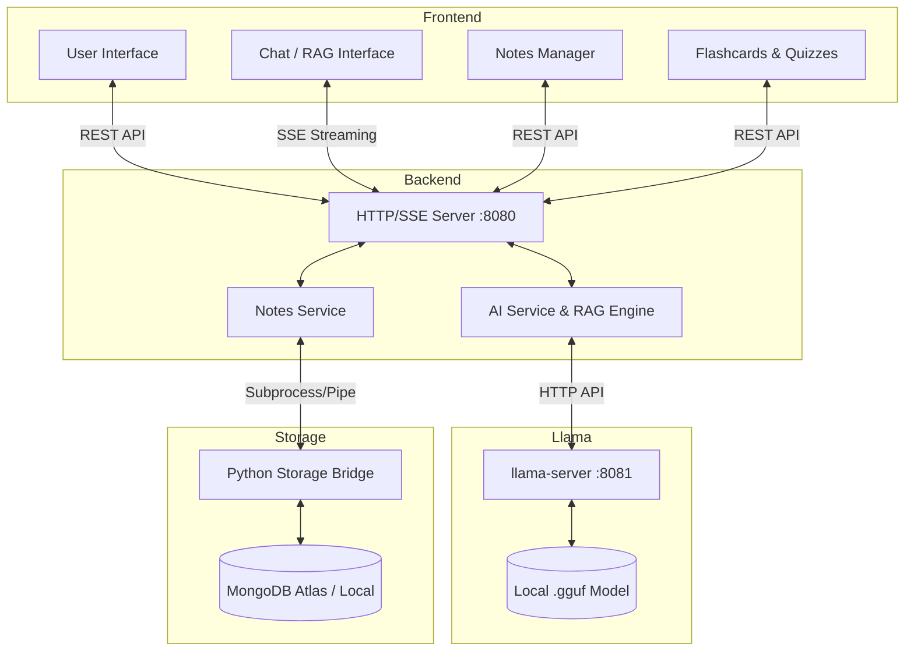

# AI Second Brain Notes Application

A privacy-focused, full-stack notes app with local AI features and cloud persistence. Built for speed, privacy, and extensibility. 

## 🚀 Tech Stack

### Frontend
- **React.js (Vite):** Blazing fast, modern frontend.
- **Vanilla CSS:** Custom styling with modern UI/UX design, glassmorphism, and responsive layouts.
- **React Markdown:** Rendering Markdown content dynamically.

### Backend
- **Pure C++20 API Server:** Custom-built HTTP and Socket server for high performance and low-level memory management.
- **llama.cpp Submodule:** Direct integration with the `llama.cpp` inference engine for running local LLMs without relying on external cloud APIs.
- **Server-Sent Events (SSE):** Streaming responses from the AI for real-time text generation.

### Database & Storage Bridge
- **MongoDB:** Cloud or local persistence layer.
- **Python Storage Bridge (`pymongo`):** A lightweight Python wrapper to handle MongoDB connections and CRUD operations, interfacing with the C++ backend.

### Infrastructure & Orchestration
- **PowerShell / Bash:** Scripts (`start-dev.ps1`) to orchestrate starting the frontend, compiling/running the C++ backend, the llama server, and the python bridge seamlessly.

---

## ✨ Features in Detail

1. **Intelligent Note Management**
   - **Create, Read, Update, Delete (CRUD):** Full control over your knowledge base.
   - **Auto-Tagging:** The AI automatically categorizes and tags your notes based on content to organize your knowledge efficiently.
   - **Version History:** Snapshotting system that tracks changes, allowing you to restore previous versions of your notes securely.

2. **Retrieval-Augmented Generation (RAG) Chat**
   - **Chat with your Second Brain:** Ask questions and get answers grounded entirely in your existing notes.
   - **Local LLM Inference:** Completely private AI processing using `.gguf` models powered by `llama.cpp`. No data is sent to OpenAI or other third parties.
   - **Streaming UI:** Answers stream in real-time via Server-Sent Events (SSE) for a seamless ChatGPT-like experience.

3. **Advanced AI Insights & Tools**
   - **Flashcard Generation:** Automatically generate study flashcards (Question & Answer pairs) from specific notes to aid active recall.
   - **Learning Roadmaps:** Transform raw study notes into highly detailed, actionable undergraduate learning roadmaps using an AI curriculum designer persona.
   - **Knowledge Graphs:** Discover connections and map relationships between different notes and topics visually.
   - **Contradiction Detection:** AI scans your notes to find conflicting information or conflicting ideas.
   - **Quiz Arena:** Auto-generated quizzes from your content with strict prompt-based constraints to guarantee the target question count.

4. **Cloud & Local Persistence**
   - **MongoDB Atlas Integration:** Sync your notes securely to the cloud.
   - **Local Caching:** Temporary storage and fallback handling.

---

## 🏗️ Architecture Overview

The following diagram illustrates the flow of data and the interaction between the different components of the system:



---

## 🛠️ Prerequisites

### General
- **Node.js 18+** & **npm 9+**
- **Python 3.10+** (with `pymongo` and `python-dotenv`)
- **g++** with C++20 support (MinGW-w64 recommended on Windows)
- **CMake** (required for building llama.cpp)
- **MongoDB** (Atlas connection string or local instance)

### Windows
- [Git for Windows](https://git-scm.com/)
- [MinGW-w64](https://www.mingw-w64.org/) or MSVC
- [CMake](https://cmake.org/download/)

---

## ⚙️ Environment Variables

Create a `.env` file in the `backend/` directory:

| Variable | Required | Description |
| :--- | :--- | :--- |
| `MONGO_DB_URL` | **Yes** | Your MongoDB connection string. |
| `SECOND_BRAIN_LLAMA_BINARY` | **Yes** | Path to `llama-cli.exe` or `llama-server.exe`. |
| `SECOND_BRAIN_MODEL_PATH` | **Yes** | Path to your `.gguf` model file. |
| `SECOND_BRAIN_PORT` | No | Backend port (Default: `8080`). |
| `SECOND_BRAIN_PYTHON` | No | Path to python executable if not in PATH. |
| `VITE_API_BASE_URL` | No | Frontend API endpoint (Default: `http://127.0.0.1:8080`). |

---

## 🚀 How to Run

### 1. Initial Setup
```bash
# Clone the repository
git clone <your-repo-url>
cd NotesAppLlmaaCpp

# Install Python dependencies
pip install pymongo python-dotenv
```

### 2. Build llama.cpp
```bash
cd llama.cpp
cmake -S . -B build
cmake --build build --config Debug -j # Or Release
```
Then activate the venv from root directory (if applicable):
```powershell
.\.venv\Scripts\Activate.ps1
```
 
### 3. Quick Start (Windows)
The easiest way to start the entire stack is using the provided PowerShell script:
```powershell
.\start-dev.ps1
```
This script will:
- Check/Compile the C++ backend.
- Launch `llama-server` on port 8081.
- Start the C++ Backend on port 8080.
- Start the Vite Frontend on port 5173.

### 4. Manual Start (Cross-Platform)

#### A. Start the Backend
```bash
cd backend
# Compile (example for Windows/MinGW)
g++ -std=c++20 -I. -I..\llama.cpp\vendor server.cpp core\ai_engine.cpp services\notes_service.cpp services\ai_service.cpp -lws2_32 -o second_brain_server.exe

# Run (Ensure .env is configured)
.\second_brain_server.exe
```

#### B. Start the Frontend
```bash
cd frontend
npm install
npm run dev
```

---

## 📡 API Endpoints

- `GET /health` — System status.
- `GET /notes` — Fetch all notes from MongoDB.
- `POST /add` — Create a new note.
- `POST /search` — AI search/chat (Standard).
- `POST /search/stream` — AI search/chat (Streaming SSE).
- `POST /insights` — Generate note metrics.
- `POST /flashcards` — Generate study cards from notes.
- `POST /graph` — Get Knowledge Graph data.

---

## 🐛 Troubleshooting

- **"ModuleNotFoundError: No module named 'pymongo'"**:
  Run `pip install pymongo python-dotenv`.
- **Backend fails to connect to MongoDB**:
  Check your `MONGO_DB_URL` in `backend/.env`. Ensure your IP is whitelisted in MongoDB Atlas.
- **AI responses are slow or empty**:
  The first query usually takes longer as the model loads into memory. Ensure `SECOND_BRAIN_MODEL_PATH` points to a valid `.gguf` file.
- **C++ Build Errors**:
  Ensure you have a modern compiler supporting C++20. Use `g++ --version` to check.

---

## 📄 License

Personal and Educational use only. Built with ❤️ for the AI Second Brain community.
