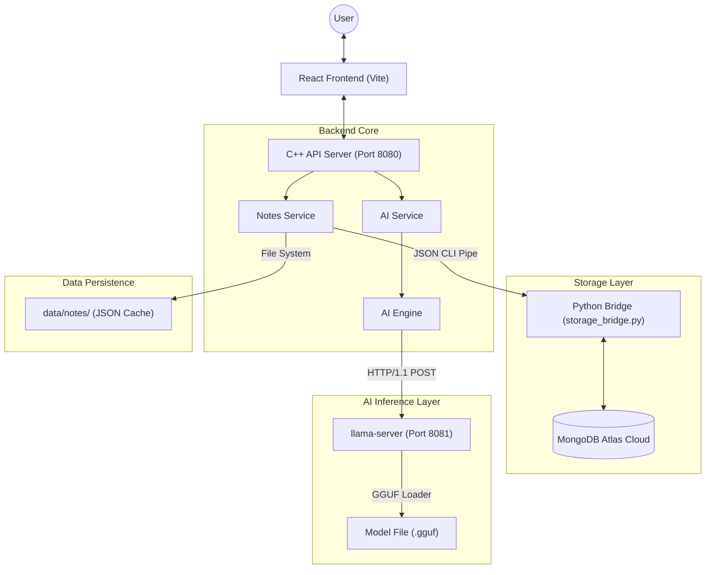
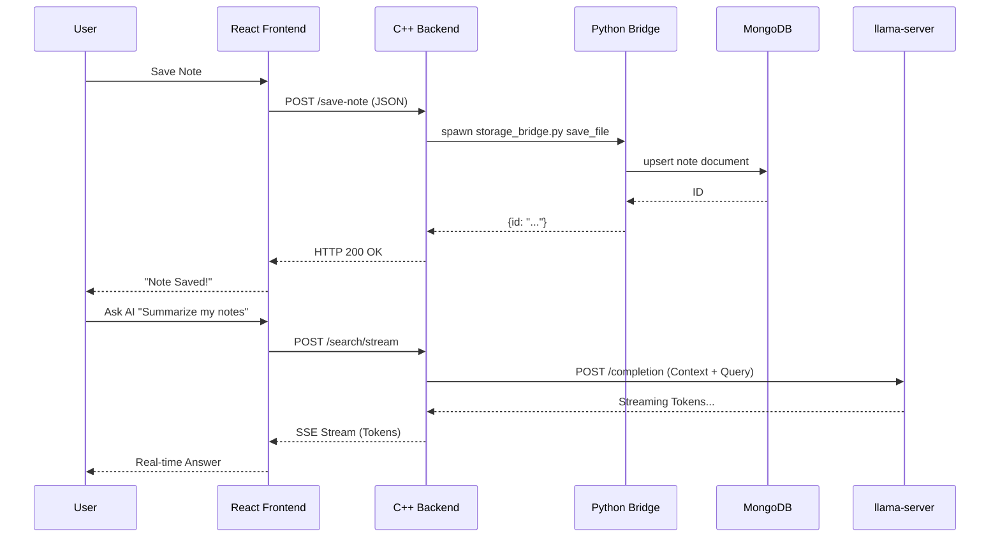

# Software Requirements Specification (SRS)
## AI Second Brain Notes Application

### 1. Introduction

#### 1.1 Purpose
The purpose of this document is to specify the functional and non-functional requirements of the AI Second Brain Notes Application. This system is designed as a privacy-focused, high-performance tool for personal knowledge management, leveraging local Large Language Models (LLMs) for analysis.

#### 1.2 Scope
The system provides a full-stack solution including:
- A modern web interface for note-taking.
- A custom C++ backend for high-efficiency request handling.
- Local AI integration for RAG (Retrieval-Augmented Generation) and note analysis.
- Cloud-synced storage using MongoDB.

---

### 2. Overall Description

#### 2.1 Product Perspective
This application is a standalone system designed for users who prioritize data privacy. Unlike cloud-only note apps, this project performs all heavy AI computation locally on the user's hardware.

#### 2.2 System Architecture
The project follows a decoupled architecture:
- **Frontend**: Single Page Application (SPA) built with React.
- **Backend**: Multi-threaded C++20 server.
- **Storage Bridge**: Python-based middleware for database abstraction.
- **Inference Engine**: `llama.cpp` running as a background service.

#### 2.3 System Diagram

### 2.4 System Sequence Flow

#### 3.1 Note Management
- **Description**: Users can create, read, update, and delete notes.
- **Functional Requirements**:
    - Automatic generation of IDs and timestamps.
    - Automatic tag generation based on content analysis.
    - Version history maintenance for every modification.

#### 3.2 AI Search & Chat (RAG)
- **Description**: Users can query their notes using natural language.
- **Functional Requirements**:
    - Semantic search across all local notes.
    - Streaming responses (SSE) for real-time AI interaction.
    - Fallback mechanisms for when the AI engine is unavailable.

#### 3.3 Advanced Knowledge Insights
- **Description**: AI-driven analysis of the entire note collection.
- **Functional Requirements**:
    - **Flashcards**: Generation of study cards from note content.
    - **Knowledge Graph**: Visualization of relationships between notes and concepts.
    - **Contradiction Detection**: Identifying conflicting information across different notes.
    - **Learning Paths**: Suggested sequence of review for knowledge mastery.

---

### 4. External Interface Requirements

#### 4.1 User Interfaces
- Responsive web design using React and modern CSS.
- Real-time visualization of the Knowledge Graph using SVG/Canvas.

#### 4.2 Software Interfaces
- **Storage Bridge Interface**: JSON-over-CLI protocol for Python-C++ communication.
- **llama.cpp Interface**: RESTful API (Port 8081) for LLM interaction.

---

### 5. Non-functional Requirements

#### 5.1 Performance
- Backend response time for standard CRUD operations: < 100ms.
- AI latency: Dependent on local hardware; optimized via `llama-server` keeping the model in RAM.

#### 5.2 Security & Privacy
- **Local First**: AI processing never sends note content to external LLM providers (OpenAI, etc.).
- **Encrypted Sync**: MongoDB Atlas connections use TLS/SSL.

#### 5.3 Reliability
- Automatic fallback from `llama-server` to `llama-cli` if the background service hangs.
- Local temporary file caching for note operations.

### 7. Unique Selling Propositions (USPs)

- **Total Data Sovereignty**: 100% Local AI processing. Your private thoughts never leave your machine.
- **Ultra-Low Latency**: C++20 custom server outperforms traditional interpreted backends.
- **Infinite Memory**: Seamless RAG (Retrieval-Augmented Generation) across your entire knowledge history.
- **Zero-Config Sync**: Combines local file-based speed with MongoDB cloud reliability.
- **Insight-First UI**: Visualize your mind via Knowledge Graphs and automated relationship mapping.

---

### 8. Technical Requirements
- **Compiler**: g++ with C++20 support.
- **Runtime**: Node.js 18+, Python 3.10+.
- **Database**: MongoDB 6.0+.
- **Memory**: 8GB+ RAM (Recommended for local LLM inference).
